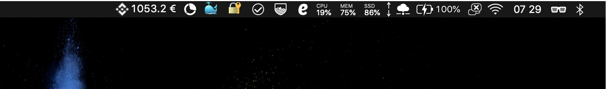
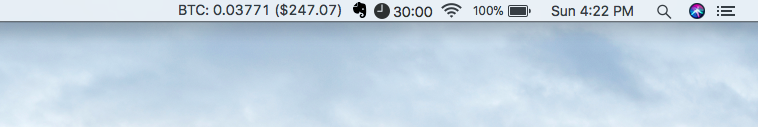

**This is a fork of [nishanthvijayan/BinanceBalanceMac](https://github.com/nishanthvijayan/BinanceBalanceMac), credit goes to [nishanthvijayan](https://github.com/nishanthvijayan/).**

New plugin output:



Original plugin output:



Changes:
- Currency switched from USD ($) to EUR (€)
- Added `DECIMALS` var to simplify end-user customisation.
- Remove BTC portfolio value. Now it does only output EUR (€) value.
- Added base64 Binance logo to save menu bar space.

Original README.md content follows below.

---

# BinanceBalanceMac
A BitBar plugin that displays your Binance portfolio value in your Mac OS X Menu Bar


## Installation

1. Install [BitBar](https://getbitbar.com/)

2. Clone this repo

3. Generate your Api key & Api Secret from Binance.  
Use this [guide](https://support.binance.com/hc/en-us/articles/360002502072-How-to-create-API) if you don't know how.  
Note: Trading permissions are not required for this app. So when you generate API keys, make sure that your disable trading and withdrawal permissions.  

3. Rename `secrets.example.json` to `secrets.json` and enter your API key & secrets in that file.  

4. Install dependencies & build
```
npm install
npm run build
```

A new folder named `dist/` would now appear. Inside `dist/` you'll find `binance-balance.2m.sh`  


5. Change permissions of `binance-balance.2m.sh` to make it executable
```
chmod +x binance-balance.2m.sh
```  


6. Drop binance-balance.2m.sh in your BitBar plugins folder.  
If you don't already have one, create a new folder anywhere and drop the script there.  
Once you've launched BitBar, you can set this new folder as the plugins folder by selecting the `Change Plugins Folder`   


7. Start BitBar using finder.

Done!
